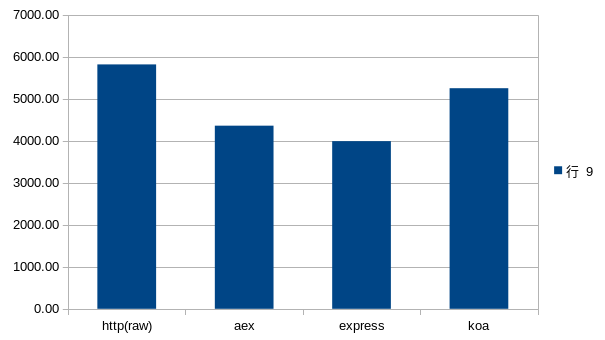

# Node.js framework Benchmarks

## root url "/"

| http(raw) | aex     | express | koa     |
| --------- | ------- | ------- | ------- |
| 5683.82   | 4463.53 | 4058.92 | 5042.28 |
| 5742.87   | 4414.53 | 4055.42 | 5293.72 |
| 5688.20   | 4547.68 | 3743.78 | 5309.73 |
| 5896.43   | 4332.36 | 3913.13 | 5255.86 |
| 5917.57   | 4104.71 | 4058.25 | 5280.56 |
| 6026.36   | 4303.74 | 4085.23 | 5333.55 |
| 5771.18   | 4349.19 | 4027.74 | 5245.15 |

the averaged results:

| http(raw) | aex     | express | koa     |
| --------- | ------- | ------- | ------- |
| 5818.06   | 4359.39 | 3991.78 | 5251.55 |

visual differences:

## none root url access "/url"

| http(raw) | aex     | express | koa     |
| --------- | ------- | ------- | ------- |
| 5987.78   | 4062.69 | 3636.43 | 4375.62 |
| 5941.46   | 4065.19 | 3677.68 | 4498.54 |
| 5973.59   | 4041.63 | 3564.66 | 4307.33 |
| 5942.72   | 4075.49 | 3429.73 | 4427.29 |
| 5970.65   | 4072.76 | 3508.85 | 4274.21 |
| 5930.92   | 4046.41 | 3534.67 | 4452.34 |

the averaged results:

| http(raw) | aex     | express | koa     |
| --------- | ------- | ------- | ------- |
| 5957.85   | 4060.70 | 3558.67 | 4389.22 |

visual differences:

## parameterized url "/user/:id"

| http(raw) | aex     | express | koa     |
| --------- | ------- | ------- | ------- |
| 5177.35   | 4366.73 | 3655.53 | 4703.51 |
| 4935.86   | 4290.90 | 3722.14 | 4811.56 |
| 5175.58   | 4326.33 | 3704.04 | 4667.66 |
| 5183.80   | 4340.19 | 3787.27 | 4899.29 |
| 5188.29   | 4362.57 | 3797.09 | 4896.09 |
| 5322.29   | 4359.82 | 3794.24 | 4718.80 |

the averaged results:

| http(raw) | aex     | express | koa     |
| --------- | ------- | ------- | ------- |
| 5163.86   | 4341.09 | 3743.39 | 4782.82 |

visual differences:

